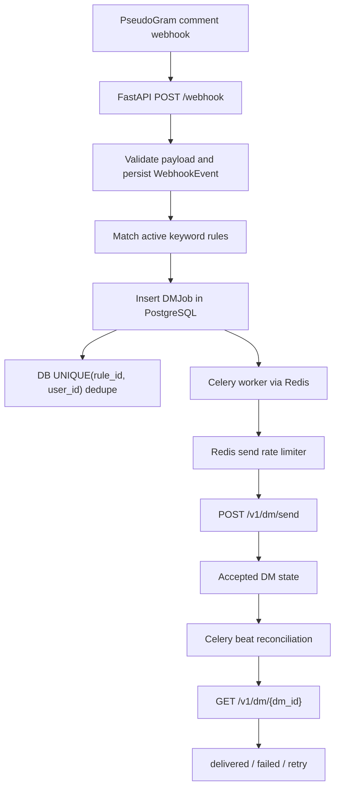

# LinkPlease

A FastAPI backend that turns Instagram-style comment webhooks into durable, deduplicated DM delivery jobs.

## Overview

LinkPlease receives mock PseudoGram comment webhooks, matches comments against keyword rules, and creates background DM jobs for matching users. The API returns quickly while PostgreSQL stores durable state and Celery workers handle outbound delivery, retries, rate limiting, and delivery reconciliation asynchronously.

This design keeps webhook ingestion lightweight and makes DM processing recoverable if Redis, workers, or the application process restart.

## Key Features

- Keyword-based comment matching, case-insensitive and substring-aware
- Exact API routes required by the assignment: `POST /webhook`, `POST /rules`, `GET /stats`
- Durable PostgreSQL persistence for rules, webhook events, DM jobs, and duplicate counters
- Database-level duplicate prevention with `UNIQUE(rule_id, user_id)`
- Celery background worker and beat scheduler
- Redis-backed shared rate limiting for outbound DM sends
- Retry handling for transient API/network failures and server-side `429 Retry-After`
- Idempotency keys for safe retry of uncertain send attempts
- Delivery reconciliation for accepted DMs via PseudoGram status checks
- `comment.deleted` handling for safely canceling queued local jobs
- Optional webhook HMAC verification, enabled by default
- Docker and Procfile support for deployment
- Automated pytest coverage for API contracts, persistence, delivery, reconciliation, deletion, HMAC, and stress behavior

## Architecture



Major components:

| Component | Responsibility |
| --- | --- |
| FastAPI | API routes, request validation, webhook ingestion |
| PostgreSQL | Source of truth for rules, events, jobs, and metrics |
| SQLAlchemy | ORM models and transactional state changes |
| Alembic | Database migrations |
| Celery | Background DM delivery and reconciliation tasks |
| Redis | Celery broker/backend and shared outbound send rate limiter |
| PseudoGram client | Outbound DM send and delivery-status HTTP calls |

## Tech Stack

| Area | Technology |
| --- | --- |
| API | FastAPI |
| Database | PostgreSQL |
| ORM | SQLAlchemy 2.x |
| Migrations | Alembic |
| Queue / workers | Celery |
| Broker / rate limiting | Redis |
| HTTP client | httpx |
| Testing | pytest, FastAPI TestClient, SQLite test databases |
| Containerization | Docker |
| External simulator | PseudoGram API |

## Project Structure

```text
app/
├── api/          # FastAPI route handlers
├── core/         # environment-based settings
├── db/           # SQLAlchemy engine/session setup
├── models/       # ORM models
├── schemas/      # Pydantic request/response models
├── services/     # PseudoGram client, delivery logic, rate limiter
└── worker/       # Celery app and tasks

alembic/          # database migrations
scripts/          # deployment/simulator helper scripts
tests/            # API, persistence, delivery, reconciliation, and security tests
Dockerfile
Procfile
requirements.txt
```

## How It Works

1. A webhook arrives at `POST /webhook`.
2. If enabled, the raw request body is verified with `X-PseudoGram-Signature`.
3. The payload is parsed with Pydantic and persisted as a `WebhookEvent`.
4. Duplicate `event_id` values are treated as webhook redelivery and not processed twice.
5. For `comment.created`, rules are matched case-insensitively against the comment text.
6. Matching rules create durable `DMJob` rows.
7. PostgreSQL enforces `UNIQUE(rule_id, user_id)` so the same user cannot receive the same rule twice.
8. Newly queued jobs are handed to Celery.
9. A worker atomically claims one queued job, checks the Redis-backed send rate limit, and calls PseudoGram.
10. Transient failures are retried with backoff while preserving the same idempotency key.
11. Accepted sends move to `accepted`; they are not counted as sent yet.
12. Celery beat periodically reconciles accepted DMs with `GET /v1/dm/{dm_id}`.
13. Reconciliation marks jobs as `delivered`, returns confirmed remote failures to a new logical delivery attempt, or permanently fails exhausted jobs.
14. `GET /stats` reports the durable current state.

## API Endpoints

| Method | Endpoint | Purpose |
| --- | --- | --- |
| `GET` | `/health` | Application and database health check |
| `POST` | `/rules` | Create a keyword-to-DM rule |
| `POST` | `/webhook` | Receive PseudoGram comment webhooks |
| `GET` | `/stats` | Return sent, failed, queued, and duplicate-blocked counts |

## Local Setup

Clone and install dependencies:

```bash
git clone https://github.com/ayushxt25/LinkPlease.git
cd LinkPlease
python -m venv .venv
```

PowerShell:

```powershell
.\.venv\Scripts\Activate.ps1
pip install -r requirements.txt
Copy-Item .env.example .env
```

macOS/Linux:

```bash
source .venv/bin/activate
pip install -r requirements.txt
cp .env.example .env
```

Set `DATABASE_URL`, `REDIS_URL`, and `PSEUDOGRAM_API_KEY` in `.env`. Then run migrations:

```bash
python -m alembic upgrade head
```

Start the API:

```bash
uvicorn app.main:app --reload
```

Start the Celery worker:

```bash
celery -A app.worker.celery_app.celery_app worker --loglevel=info
```

Start Celery beat:

```bash
celery -A app.worker.celery_app.celery_app beat --loglevel=info
```

## Environment Variables

| Variable | Required | Default | Purpose |
| --- | --- | --- | --- |
| `APP_NAME` | No | `LinkPlease Webhook Service` | FastAPI application title |
| `ENVIRONMENT` | No | `development` | Rejects SQLite when set to `production` |
| `DATABASE_URL` | Yes for deployed/PostgreSQL use | `sqlite:///./linkplease.db` | SQLAlchemy database URL, for example `postgresql+psycopg://DB_USER:DB_PASS@DB_HOST:5432/DB_NAME` |
| `REDIS_URL` | Yes for Celery/rate limiting | `redis://localhost:6379/0` | Celery broker and Redis rate limiter URL |
| `CELERY_RESULT_BACKEND` | No | `REDIS_URL` | Celery result backend URL |
| `PSEUDOGRAM_API_KEY` | Yes for webhooks/sends/simulator | none | PseudoGram API key |
| `PSEUDOGRAM_BASE_URL` | No | `https://pseudogram-api.onrender.com` | PseudoGram API base URL |
| `VERIFY_WEBHOOK_SIGNATURES` | No | `true` | Enables strict HMAC verification |
| `PSEUDOGRAM_SEND_RATE_LIMIT` | No | `10` | Outbound send limit per window |
| `PSEUDOGRAM_SEND_RATE_WINDOW_SECONDS` | No | `60` | Rate-limit window size |
| `DM_MAX_ATTEMPTS` | No | `5` | Max transient send attempts |
| `DM_SENDING_STALE_SECONDS` | No | `300` | Stale send-claim recovery threshold |
| `DM_MAX_DELIVERY_ATTEMPTS` | No | `3` | Max logical delivery attempts after remote failures |
| `DM_RECONCILE_DELAY_SECONDS` | No | `30` | Delay between accepted-DM reconciliation checks |
| `DM_RECONCILING_STALE_SECONDS` | No | `300` | Stale reconciliation-claim recovery threshold |

Managed PostgreSQL URLs beginning with `postgres://` or `postgresql://` are normalized to `postgresql+psycopg://`.

## Creating a Rule

```bash
curl -X POST http://localhost:8000/rules \
  -H "Content-Type: application/json" \
  -d '{"keyword":"PRICE","dm_message":"Here'\''s the price list"}'
```

Response:

```json
{
  "rule_id": "2b39d9d0-4d74-4d42-bc87-5a66f5a85d9a",
  "keyword": "PRICE",
  "dm_message": "Here's the price list"
}
```

## Webhook Example

`POST /webhook` accepts PseudoGram comment events:

```json
{
  "event_id": "evt_01J8ZQ4K2N7RXA",
  "event_type": "comment.created",
  "sent_at": "2026-08-10T09:14:22.481Z",
  "data": {
    "comment_id": "cmt_9f2a7c",
    "post_id": "post_44de1b",
    "text": "PRICE please",
    "created_at": "2026-08-10T09:14:21.900Z",
    "from": {
      "user_id": "usr_3b91fe",
      "username": "arjun.shoots"
    }
  }
}
```

`comment.deleted` events contain only `comment_id` under `data`. The service cancels matching local jobs only while they are still safely `queued`.

## Running the Simulator

The manual simulator helper starts a PseudoGram simulation, fetches simulator truth, and optionally fetches this app's `/stats` for comparison.

```bash
python scripts/run_simulation.py \
  --webhook-url https://your-app.example.com/webhook \
  --app-base-url https://your-app.example.com \
  --count 500 \
  --duration-seconds 10 \
  --poll-seconds 60
```

The script reads `PSEUDOGRAM_API_KEY` from the environment unless `--api-key` is provided. It never prints the API key.

## Stats Semantics

`GET /stats` returns exactly:

```json
{
  "sent": 0,
  "failed": 0,
  "queued": 0,
  "duplicates_blocked": 0
}
```

| Field | Meaning |
| --- | --- |
| `sent` | Jobs confirmed remotely as `delivered` |
| `failed` | Jobs permanently abandoned after retry or delivery-attempt limits |
| `queued` | Unresolved jobs in `queued`, `sending`, `accepted`, or `reconciling` |
| `duplicates_blocked` | Duplicate DM creation attempts blocked by `(rule_id, user_id)` |

Accepted PseudoGram sends are not counted as `sent` until reconciliation confirms delivery.

## Reliability Decisions

- PostgreSQL is the durable source of truth; Redis/Celery only coordinate background work.
- `webhook_events.event_id` prevents webhook redelivery from creating duplicate work.
- `dm_jobs` has a database-level `UNIQUE(rule_id, user_id)` constraint for the core deduplication guarantee.
- Send retries preserve the same persisted idempotency key for uncertain attempts.
- Remote confirmed delivery failures create a new logical delivery attempt with a new idempotency key.
- Redis-backed rate limiting coordinates outbound sends across workers.
- Periodic recovery scans queued and accepted jobs so work can resume after worker or broker interruptions.
- `sending` is treated as potentially in-flight; `comment.deleted` only cancels jobs still in `queued`.

## Testing

Run the test suite with:

```bash
pytest
```

The tests cover API contracts, webhook validation, persistence, deduplication, retry behavior, rate limiting, recovery, delivery reconciliation, deletion handling, signature verification, deployment configuration, and a local 500-event volume regression. External PseudoGram traffic is mocked or avoided in automated tests.

## Deployment

The app is container-ready:

```bash
docker build -t linkplease .
docker run --env-file .env -p 8000:8000 linkplease
```

The included `Dockerfile` starts `scripts/start_render.sh`, which runs FastAPI, one Celery worker, and Celery beat in the same container. This is useful for constrained single-service environments. For a more robust deployment, run web, worker, and beat as separate processes/services:

```bash
python -m alembic upgrade head
uvicorn app.main:app --host 0.0.0.0 --port $PORT
celery -A app.worker.celery_app.celery_app worker --loglevel=info
celery -A app.worker.celery_app.celery_app beat --loglevel=info
```

## Limitations and Trade-offs

- Delivery status is eventually consistent because accepted DMs require reconciliation.
- Throughput is intentionally constrained by the documented PseudoGram send rate limit.
- Co-locating web, worker, and beat in one container is a deployment compromise; separate services are preferable when available.
- `VERIFY_WEBHOOK_SIGNATURES` defaults to `true`, but it can be disabled for simulator environments where the live signature behavior does not match the documented raw-body HMAC contract.
- Local high-volume tests use SQLite for isolation; final concurrency confidence should be validated with PostgreSQL.

## Future Improvements

- Separate web, worker, and beat deployments by default
- Structured operational metrics and dashboards
- Dead-letter handling for exhausted jobs
- Admin tooling for inspecting jobs and webhook events
- Stronger deployment health checks for worker and beat processes

## Author

Ayush
